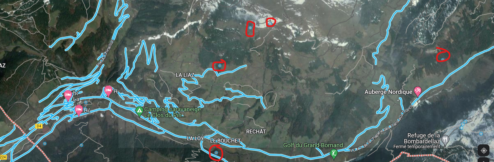

# Write-Up RedTeam & OSINT
#### _Router> enable - CISCO2811-HSEC/K9_

## Table of Contents
1. RedTeam
    - [CTFDisaster](#ctfdisaster)
    - [Foothold](#foothold)

2. OSINT
    - [Back to the future!](#back-to-the-future)
    - [Don't trust google!](#dont-trust-google)
    - [Coghin G Bell!](#coghin-g-bell)
    - [Rosay's lost](#rosays-lost)


## CTFDisaster

We just know the IP address of the host. Let's run a nmap scan to know more about the target(open ports, services, OS, etc.)

```python
nmap -sV -T4 -p- 10.0.0.5 
```
Explainations about the args : 
> __-sV__: Probe open ports to determine service/version info

> __-T<0-5>__: Set timing template (higher is faster)

> __-p<port ranges\>__: Only scan specified ports. _In this case_ __-p-__ _is equivalent to_ __-p1-65535__

We get the following output : 


The port 6645 is running an unknown service

The port is not known to run any service. Let's try some basic stuff such as opening it with Firefox
```python
firefox http://10.0.0.5:6645 &
```

We can find a CTF website with differents tabs. Let's give a try to register and login tabs. Let's try to register an account on the platform.

Success ! We can have our own account. Let's login using the new account and looking for some challenges 😎

We can see an author : undercut_monkey. He must be an admin because he could create a challenge !
We need more iinformation. We have an admin login but the password is still missing. 

Let's try to find an exploit for the Web service. As we can see it's written 
`Powered by CTFd`. Let's check known vulnerabilities against CTFd. When you don't have more clues, you should give a try about the running service.
A CVE is known for CTFd : [CVE 2020-7245](https://nvd.nist.gov/vuln/detail/CVE-2020-7245). To exploit the vulnerability, one must register with a username identical to the victim's username, but with white space inserted before and/or after the username. This will register the account with the same username as the victim. After initiating a password reset for the new account, CTFd will reset the victim's account password due to the username collision.
Let's try to register a new account using undercut_monkey

Let's reset the password for the account.

We submit.

We have received our reset link !!


We change the password with something we want to log in with.


---

We have the admin panel 🥳
Let's check the Challenge Flag where we could find the admin username.

GG ! ZiTF{95f2d3074260851411065100284dee8d}

----
----
----
## Foothold
Let's try to get a shell on the host. We have to look within other tabs. Let's check Pages Tab


We have two routes ! One is hidden. Something must be there/

We learn we cannot use passwords with ssh anymore. We have to find the SSH private key in order to do it inside the folder `5f990814d86cf7b1152101be22e7c5a5/ssh_key_647032702ede7e519b1eb0279ba0ef99572e92.zip`

Let's check the config tab. 

We can download a backup of the CTF. We get a ZIP file.

We have the file `5f990814d86cf7b1152101be22e7c5a5/ssh_key_647032702ede7e519b1eb0279ba0ef99572e92.zip` !

Let's try to open it.


We need a password to open the zip. Let's use the tool ``zip2john` to process input ZIP files into a format suitable for use with JohnTheRipper, a password cracker.

We can now use JohnTheRipper

We have the password of the ZIP file : bonobo. We can know use it to extract the key and use it to connect with SSH. By default, the ssh key will have more rights than needed when extracted. Some SSH versions won't accept those kind of keys, so to be sure let's remove some rights using chmod.
```python
chmod 700 monkey_ssh
```
> __700__ : __RWX__ rights for the owner, __---__ rights for the group, and __---__ rights for other users.

The 


Two SSH ports are open. Let's try with the classic one port 22. We can't use it to authenticate. Let's try with the other one : 2222.
```python
ssh undercut_monkey@10.0.0.5 -i monkey_ssh -p 2222
```
> -i: Specify the path to the private key file.

> -p: Specify the port

We can connect and print the flag 
`ZiTF{e845bdb8696955f35c44db42775523e8}`
GG !

---
---
---

## Back to the future!
The name is quite explicit. We have to find something in the past. We can use [ZiTF - web.archive.org](https://web.archive.org/web/20230227063548/https://zitf.fr/). 


The former user is `hamspac3monk3y`. GG !


---
---
---

## Don't trust Google!
We have the username and we know that Ham is suspected of hiding on the net. The first thing to do when you want to do OSINT on username is checking all the social networks with the username. You can use tools like [Sherlock](https://github.com/sherlock-project/sherlock) which is one of the most famous OSINT tools for username. But you can also use online tools such as [Instant Username](https://instantusername.com/#/).

There is a Twitter account linked to the username. 


GG ! 
`ZiTF{f26681bf54285378e8902e1770cdec4c}`

---
---
---

## Coghin G Bell!

pending...

---
---
---

## Rosay's lost
We need the GPS coordinates of the user.
We have few hints about the location :
- 5km north of La Clusaz

and this picture


We know already an approximative position : La Cluzas.
Let's draw a 5km radius circle around La Cluzas using [2kmfromhome](https://2kmfromhome.com/5km).


The north limit is `Le Grand Bornand` let's use Google Maps !
When you want to find a pedestrian perspective using Google Maps you always have to look at pcitures uploaded by users and not coming from Google. The Google Car won't help you to find dirt path as we can see in the lower left corner of the picture.
We have to look at the south side of Le Grand-Bornand. The cameraman is facing SE/S/SW. We wouldn't be able to see the sunbeams on the left otherwise. Moreover a mountain is in the middle of the village and La Cluzas is located in the south of Le Grand-Bornand. Let's check for `User Pictures` on the south of Le Grand Bornand.


Let's check the one in the middle.

Luckily, it's a paragliding picture. We can see all the similiraties with the first picture. We are facing the West on the paragliding picture ! Let's find the first StreetView option on the West side of the pic.

We can go on this position.

It's the same position ! Let's get the GPS coordinates

`ZiTF{45.9471_6.4457}`
